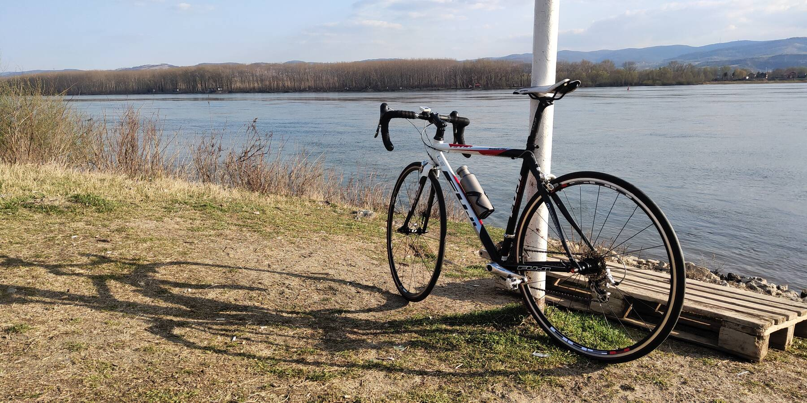

Ну что ж. Back on track, как говорится... Купил велосипед. Старый алю шоссер 2008 (кажется) года, Fuji Roubaix PRO, 
больше таких не делают. Карбоновая вилка и карбоновый хвост, вес около 9кг. От родной навески не осталось практически 
ничего, всё железо — древняя Ultegra (где-то 2003 года, кажется, R6600), колёса Oval Concepts 524.

После десятилетнего перерыва всё будет катить, я понимаю... Но этот вроде действительно катит :) Вчера совершил первый 
пробно-регулировочный выезд вдоль Дуная. Очень приятный ход, неровности дороги карбоний подъедает вполне исправно. В 
целом доволен, разве что седло не моё. Хотя, может быть, и прикатается.

Что удивило: местные собаки вообще никак не реагируют на велосипедиста. Видимо, двухколёсных тварей в Воеводине 
настолько много, что собаки тупо привыкли к образу.

Шоссейники здороваются со встречными шоссейниками. Прямо как мотоциклисты. Прикольно.

В планах — раскатать хорошенько Фрушку гору вдоль и поперёк, ну и, разумеется, проехать хотя бы один 200км марафон в 
этом году.
