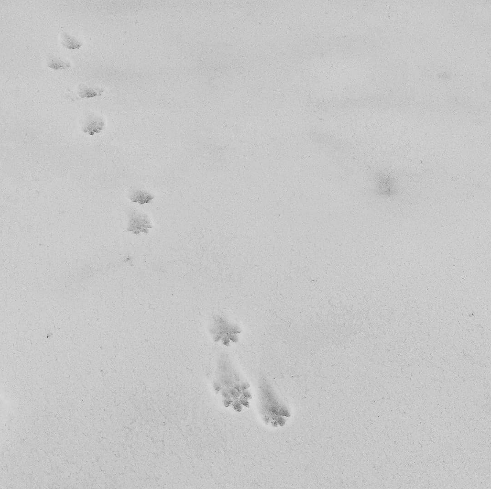

В ту ночь я почти поверил в домовых.

Сидишь. За окном, как обычно, гробовая тишина. Редко залает собака, ещё реже проедет случайная машина. Есть я, мой стол с ноутбуком да настольная лампа. И вдруг — суетливый топот маленьких ножек где-то сверху, по крыше.

Посидел, подумал. Ну, наверное, какой-то странный зверь ходит. Топот тем временем то появлялся, то исчезал. Непонятно. Вышел на улицу с фонарём, посветил на крышу, обошёл дом кругом — никого. Тишина.

Поработал ещё пару часов. Поднимаюсь в спальню, ложусь спать… И тут уже прямо над головой: топочут! Проснулась Олька, спрашиваю — ты тоже слышишь? Тоже слышит. Значит, всё-таки какой-то зверь. Спим.

Через пару дней история повторяется. Топочут! Крайне аккуратно выхожу с фонарём во двор, обхожу… Вот она, скотина! По водостоку бежит от меня, прыгает на грушу, с груши на балкон, с балкона наземь и за забор со всех ног. Чёрно-коричневая пушистая зверюга с хвостом в половину тела, с дугообразной спиной и невероятно быстрая. Ручаюсь, что увидеть я её смог только потому, что ей было любопытно, кто это за ней несётся и светит. Куница. [Каменная куница](https://ru.wikipedia.org/wiki/%D0%9A%D0%B0%D0%BC%D0%B5%D0%BD%D0%BD%D0%B0%D1%8F_%D0%BA%D1%83%D0%BD%D0%B8%D1%86%D0%B0).

После той встречи мы ещё не раз слушали, как наша куница заходит в дом переночевать. Мы не то, чтобы *смирились* с тем, что над нашей головой дрыхнет мелкий лесной хищник. Мы *разделили с ней жизненное пространство:* спать куница приходила поздней осенью, с первыми холодами, и уходила весной в течение нескольких лет.

Бывало, она приходила поздно ночью и суетливо топотала, укладываясь спать поудобнее. Бывало, громко и по-хамски заваливалась на чердак, грузно топала ногами, разве что не орала матросские песни. Случалось подозревать её и в том, что она приволакивала в дом добытую где-то жертву. Бонусом мы получили полную пропажу мышей-полёвок, забирающихся зимовать в перекрытиях.

Пробовал подкормить: выкладывал на балкон плошку с мёдом. Ноль эмоций. То ли мёд невкусный, то ли плошка страшная, то ли мышей в том году изрядно было.

Немного по ней скучаем. Хорошее соседство было.

