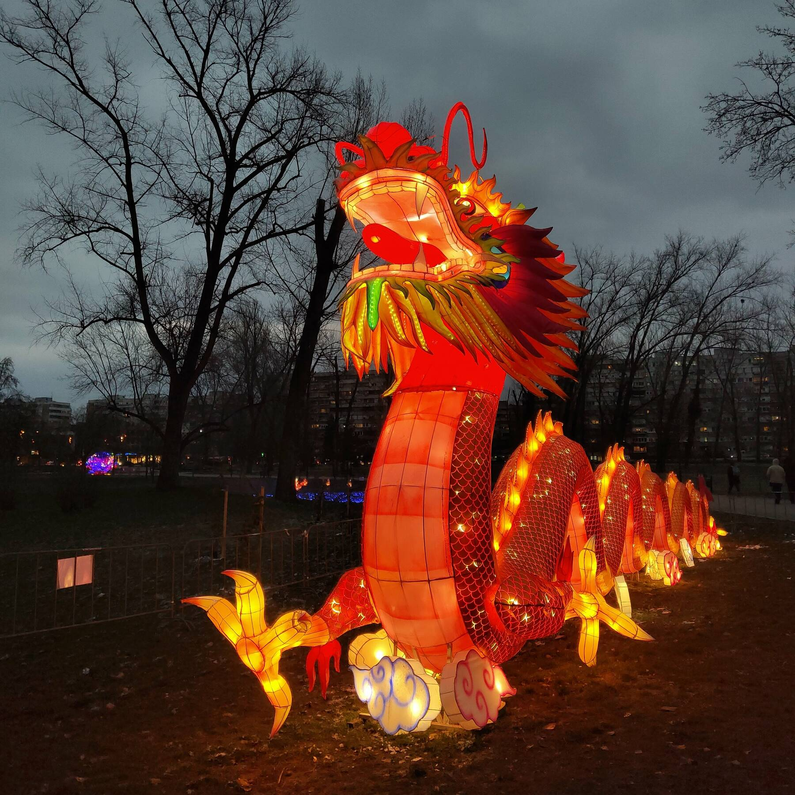
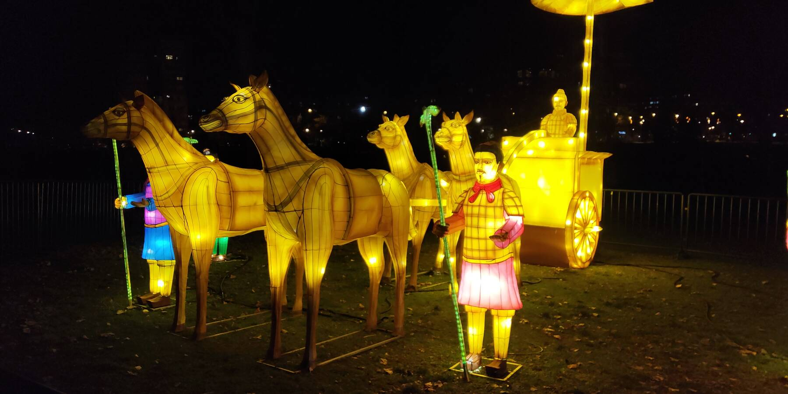
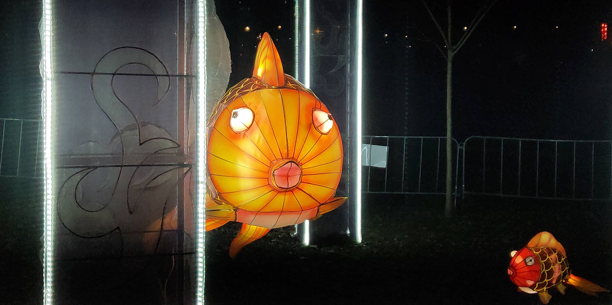

Местные китайцы устроили в Лиманском парке световые инсталляции в честь своего лунного нового года. Здорово получилось!

Некоторые фигуры смотрятся особенно хорошо в фас: понимаешь, что ты всё-таки не самый глупый на этом свете.

А больше всего мне понравились вот эти фонарики. [Атмосферная штука.](../../moments/Китайские%20фонарики)

