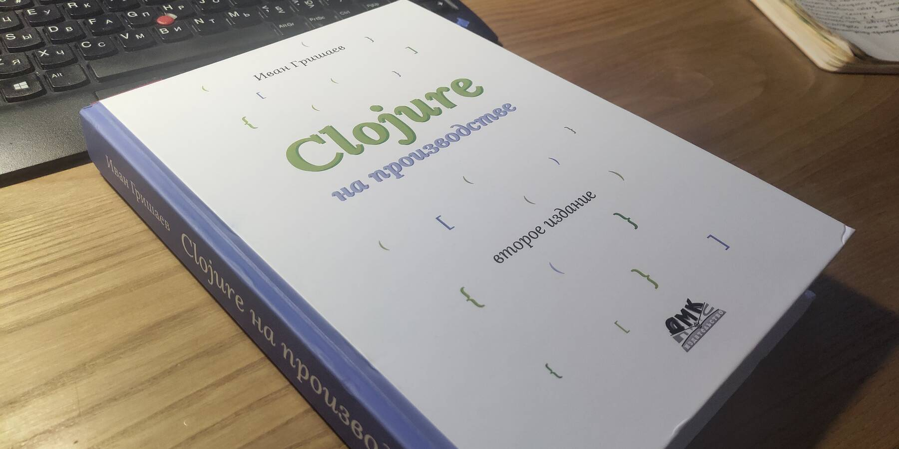

Встретил такой вот кусочек кода и сначала не понял, что тут происходит. Потом врубился и аж захотелось заметку про эту красоту набросать.

```clojure
(if-let [order (some-> request
                       :route-params
                       :id
                       Integer/parseInt
                       get-order-by-id)]
    (action-if-true order)
    (action-if-nil))
```

Что здесь делается, вкратце: обрабатывается некий словарь `request`, в котором, может быть, есть ключ `route-params`, в котором, вероятно, лежит ещё один словарь, в котором, может быть, есть ключ `id`, в котором, теоретически, может лежать некое целочисленное значение, по которому мы, возможно, можем получить ассоциированную с ним сущность `order`. По случаю такой невероятной удачи мы должны предпринять некие действия с заказом `order` (функция `action-if-true`), а иначе — сделать что-то другое (функция `action-if-nil`).

Вот, например, как это можно было бы написать на питоне:

```python
try:
    route_params = request.get('route_params')
    order_id = int(route_params.get('id'))
    order = get_order_by_id(order_id)
except AttributeError, TypeError:
    return action_if_nil()
return action_if_true(order) if order else action_if_nil()
```

Сначала мы пытаемся, обернувшись в `try/except`, вытащить нужную информацию из `request`. Хорошо бы помнить, какие именно исключения могут быть брошены каждой инструкцией: `int(None)` бросит TypeError, `None.get()` бросит AttributeError. Ещё мы не знаем, какое исключение может кинуть `get_order_by_id()`. Можно, конечно, написать просто `except:`, но в приличных домах за такое бьют канделябром.

Дальше происходит неуклюжая проверка на существование собственно заказа `order`. Почему неуклюжая? Потому что в случае неудачи мы вызываем `action_if_nil()`, который только что засветился парой строк выше. Во-первых, в глазах рябит, во-вторых, когда-нибудь можно не заметить, что эта функция вызывается в двух местах и поменять её только в одном месте. Код многословен и избыточен, не декларативен. Вместо описания бизнес-логики мы описываем то, как компьютер должен выполнять команды.

Причём задача, в общем-то, вполне рядовая. Как она решена в Clojure, какие фичи языка дают такую читаемость и лаконичность?

По порядку:

1. `some->`. Этот макрос разворачивается в код, который последовательно будет решать все формы, подставляя результат выполнения каждой как первый аргумент следующей. А если какая-то форма отдаст nil, цепочка вызовов сразу прекращается и возвращается этот самый nil (похоже на монаду `Either`). В нашем примере первая форма — `request`, она и пойдёт в качестве параметра следующей. Получится `:route-params request`. Ну и так далее.

2. `:route-params что-нибудь`? Разве на первом месте в формах не должна стоять функция? Должна, всё верно. Но в Clojure кейворды в мапах (словарях) автоматически [являются функциями](https://blog.jdriven.com/2020/07/clojure-goodness-keyword-as-function/) (реализуют интерфейс `IFn`):

   ```clojure
   user=> (def apple {:color "green"})
   #'user/apple
   user=> (= (:color apple) (get apple :color))
   true
   ```

   Так что во второй и третьей строчке мы просто получаем значения из мап: сначала из `request` добываем значение по кейворду `:route-params`, а потом из `:route-params` добываем значение по кейворду `:id`.

3. Локальный [биндинг](http://xahlee.info/clojure/clojure_binding_forms.html) `let` действует точно так же, как в хаскеле; только, на мой вкус, читается лучше:

   ```haskell
   let foo = "Hello "; bar = "world!"
   in foo ++ bar
   ```

   ```clojure
   (let [foo "Hello "
         bar "world!"]
       (+ foo bar))
   ```

   Но в примере штука ещё более интересная, `if-let`. Этот макрос разворачивается в локальный биндинг и ветвление:

   ```clojure
   (let [temp-result (some-> ...)]
       (if (= nil temp-result)
           (action-for-nil)
           (let [order temp-result]
               (action-for-order order))))
   ```

Такие пироги. Попробуйте теперь прочитать приведённый в начале заметки код. Трудно не согласиться, что именно так должны писаться программы, чтобы их было легко читать и понимать суть написанного!

Пример, кстати, взят из второго издания книги Ивана Гришаева *«Clojure на производстве»,* которую я незамедлительно приобрёл у автора, как только узнал о выходе второго издания. Рекомендую каждому, кто уже не боится скобочек и хочет запилить что-то настоящее на взаправдашнем лиспе.


